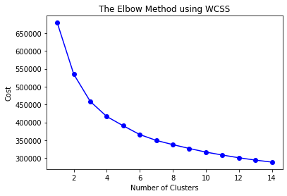
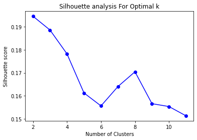
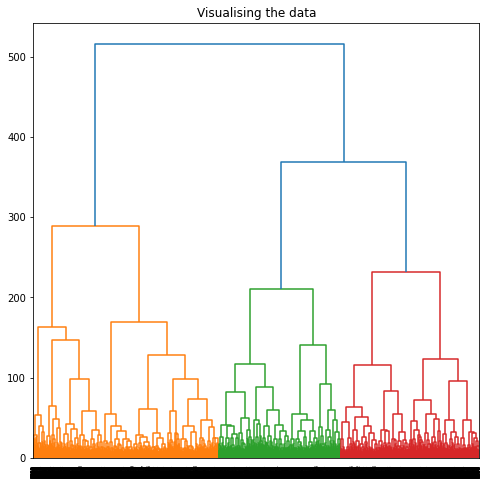
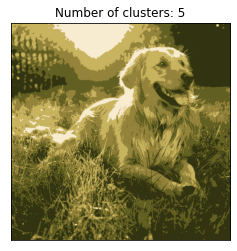
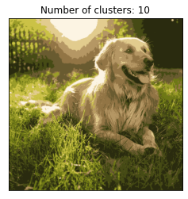
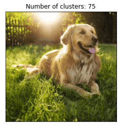
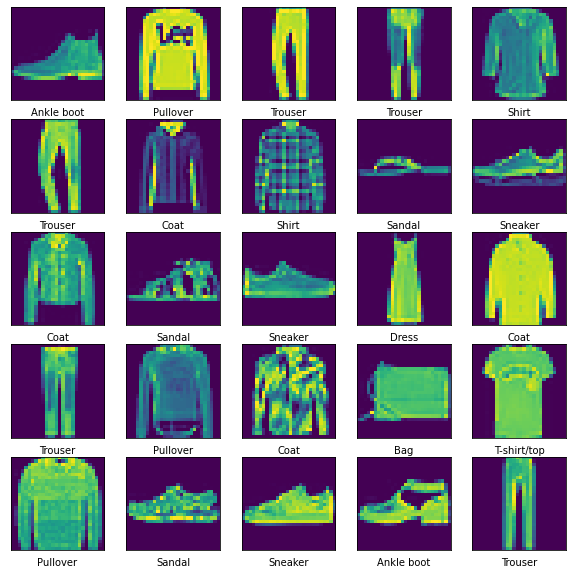

# Clustering-Exploration-on-Fashion-MNIST

## Description

This repository contains a Jupyter Notebook that explores various clustering techniques applied to the Fashion MNIST dataset. The notebook consists of three parts:

### Part 1: K-means Clustering

In this part, K-means clustering is applied to the Fashion MNIST dataset. KMeans is applied on pixels of Images. Elbow method and silhoutte score graph is used to identify te optimal number of clusters.

### Part 2: Hierarchical Clustering (Dendrograms)

In this part, hierarchical clustering is used to analyze the Fashion MNIST dataset. Hierarchical clustering builds a hierarchy of clusters by either merging or splitting them. One common visualization of hierarchical clustering is a dendrogram, which shows the hierarchical structure of the clusters.Here we used Single linkage, Complete Linkage and Ward for visualising. The dendrogram allows us to identify the optimal number of clusters by observing the lengths of the vertical lines that are merged.

### Part 3: K-means Clustering on Image Pixels

This part focuses on applying K-means clustering to the pixels of an image. Instead of clustering based on categories, the notebook demonstrates how to cluster pixels based on their color values. The notebook takes an image and applies K-means clustering for different values of K. It then compares and displays three resulting images to observe the impact of different K values on the clustering results.

## Dataset
Each image is 28 pixels in height and 28 pixels in width, for a total of 784 pixels in total. Each pixel has a single pixel-value associated with it, indicating the lightness or darkness of that pixel, with higher numbers meaning darker. This pixel-value is an integer between 0 and 255. The training and test data sets have 785 columns. The first column consists of the class labels (see above), and represents the article of clothing. The rest of the columns contain the pixel-values of the associated image. You can check out the dataset here: [Fashion MNIST](https://www.kaggle.com/datasets/zalando-research/fashionmnist)

Few images from dataset:

## Concepts

### KMeans Clustering
K-means clustering is a popular unsupervised machine learning algorithm used for partitioning a dataset into K distinct clusters. It starts by randomly initializing K cluster centroids and assigns each data point to the nearest centroid based on a distance metric, often Euclidean distance. The algorithm then iteratively updates the centroids by computing the mean of the data points assigned to each cluster. This process continues until the centroids no longer change significantly or a maximum number of iterations is reached. K-means aims to minimize the within-cluster sum of squares, creating compact and well-separated clusters. It is efficient and widely used for various clustering tasks.

### Dendograms
Dendrograms are visual representations of hierarchical clustering results. They illustrate the hierarchical relationships between clusters by depicting a tree-like structure. The vertical axis represents the similarity or dissimilarity between clusters, while the horizontal axis represents the merging or splitting of clusters at different levels of the hierarchy.

### Elbow method
The elbow method is a technique used to determine the optimal number of clusters in a dataset. It involves plotting the sum of squared distances between data points and their nearest cluster centroid for different numbers of clusters. The "elbow" in the plot indicates the point where adding more clusters doesn't significantly improve the clustering performance, suggesting the appropriate number of clusters.

### Silhoutte Score
The silhouette score is a measure of how well each data point fits within its assigned cluster compared to other clusters. It quantifies the cohesion within clusters and separation between clusters, ranging from -1 to 1. A higher silhouette score indicates better clustering quality.

## Contribution

Any Contributions are most welcome. Feel free to play around the notebook and suggest changes.

